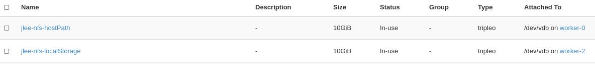

# Deploy Local Storage Operator

## Steps
- Attach disk to the node that NFS server will be running
  - In this tutorial, 
    - we will use worker-2 for localstorage
    - we will use worker-0 for hostPath (optional)
      - Or, you can create a folder for hostPath just for testing.

### Local Storage 
[Offical Doc](https://docs.openshift.com/container-platform/4.5/storage/persistent_storage/persistent-storage-local.html#local-storage-install_persistent-storage-local)

~~~

export product-verion=4.5
export target-node=worker-2.bell.tamlab.brq.redhat.com
export dev-path=/dev/vdb

echo"
apiVersion: v1
kind: Namespace
metadata:
  name: local-storage
---
apiVersion: operators.coreos.com/v1alpha2
kind: OperatorGroup
metadata:
  name: local-operator-group
  namespace: local-storage
spec:
  targetNamespaces:
    - local-storage
---
apiVersion: operators.coreos.com/v1alpha1
kind: Subscription
metadata:
  name: local-storage-operator
  namespace: local-storage
spec:
  channel: "${product-version}" 
  installPlanApproval: Automatic
  name: local-storage-operator
  source: redhat-operators
  sourceNamespace: openshift-marketplace" |oc create -f -

oc project local-storage

echo "
apiVersion: "local.storage.openshift.io/v1"
kind: "LocalVolume"
metadata:
  name: "local-disks"
  namespace: "local-storage" 
spec:
  nodeSelector: 
    nodeSelectorTerms:
    - matchExpressions:
        - key: kubernetes.io/hostname
          operator: In
          values:
          - ${target-node}
  storageClassDevices:
    - storageClassName: "local-sc"
      volumeMode: Filesystem 
      fsType: xfs 
      devicePaths: 
        - ${dev-path}" | oc create -f -
  
~~~

### HostPath

~~~
export target-node=worker-0.bell.tamlab.brq.redhat.com

oc debug node/${target-node}

chroot /host

mkdir /home/core/nfs

chcon -Rvt svirt_sandbox_file_t ./nfs
~~~

