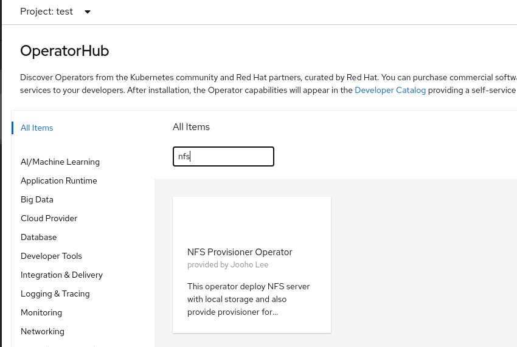
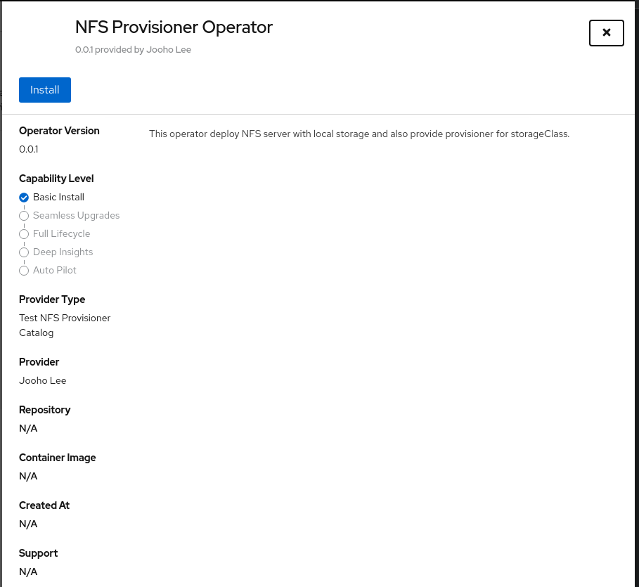
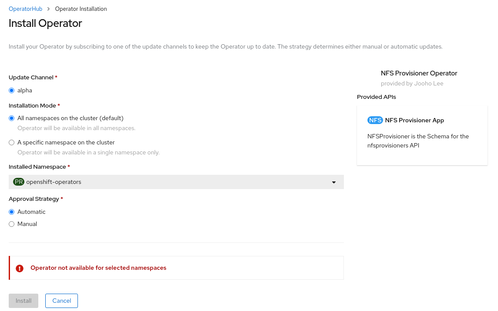
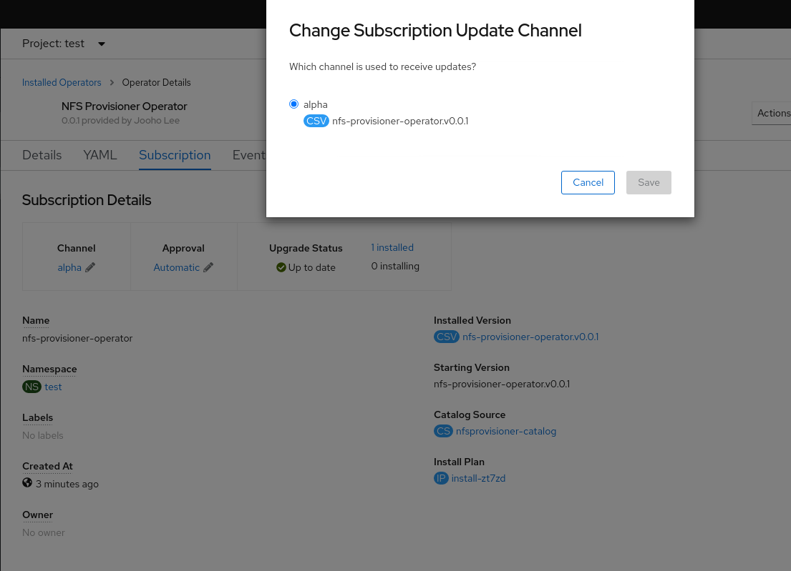
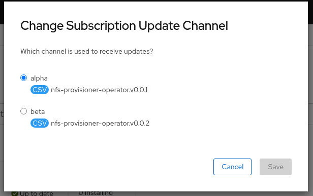

# NFS Provisioner Operator OLM(Operator Lifecyle Management) - Operator Registry
[OLM Summary](Tutorial-6-Operator-OLM-Summary.md#Bundle)

OLM and Operator Registry consumes Operator bundles via an index image, which are composed of one or more bundles.

## Objects
- With the bundle from Tutorial-8, you will build Operator Registry
  - Using `opm registry`
  - Using `opm index`
- Deploy NFS Provisioner through OpenShift Console

## Tutorial Flows
- Part 1
  - Create Registry DB with NFS Provisioner 0.0.1 (beta channel)
  - Add this registry db to OLM
  - Install NFS Provisioner via console
  - Update the bundle to 0.0.3 (alpha channel)
  - Add the bundle to the DB
  - Check if alpha channel added
  - Clean up
- Part 2
  - Create index image with NFS Provisioner 0.0.3 (alpha channel)
  - Add this index to OLM
  - Install NFS Provisioner via console
  - Update the bundle to 0.0.4 (stable channel)
  - Add the bundle to the index
  - Check if stable channel added
  - Clean up

## Steps for Part 1

### 1. Create Registry DB with NFS Provisioner 0.0.1 (beta channel)
- Set env variables
  ~~~
  export NEW_OP_NAME=test-nfs-provisioner-operator
  export NEW_OP_HOME=${ROOT_HOME}/operator-projects/${NEW_OP_NAME}
  export NAMESPACE=${NEW_OP_NAME}

  export VERSION=0.0.1
  export IMG=quay.io/jooholee/${NEW_OP_NAME}:${VERSION}
  export BUNDLE_IMG=quay.io/jooholee/${NEW_OP_NAME}:-bundle${VERSION}
  export CHANNELS=alpha
  export DEFAULT_CHANNEL=alpha
  
  make bundle
  ~~~

- Delete replaces
  ~~~
  vi bundle/manifests/nfs-provisioner-operator.clusterserviceversion.yaml
  
  replaces: test-nfs-provisioner-operator.v0.0.2   <=== Delete
  version: 0.0.1
  ~~~

- Build a bundle image 0.0.1
  ~~~
  make bundle-build bundle-push IMG=${BUNDLE_IMG}
  ~~~
- Add the bundle(0.0.1) to the db
  ~~~
  opm registry add -b ${BUNDLE_IMG} -d "test-registry.db"
  ~~~

### 2. Add this registry db to OLM
- Deploy Operator Registry with `test-registry.db`
  ~~~
  opm registry serve -d "test-registry.db" -p 50051 

  WARN[0000] unable to set termination log path            error="open /dev/termination-log: permission denied"
  INFO[0000] Keeping server open for infinite seconds      database=test-registry.db port=50051
  INFO[0000] serving registry                              database=test-registry.db port=50051

  ~~~
- Create CatalogSource for the Registry DB
  ~~~
  cat <<EOF | oc apply -f -
  apiVersion: operators.coreos.com/v1alpha1
  kind: CatalogSource
  metadata:
    name: nfsprovisioner-catalog
  spec:
    sourceType: grpc
    address: 10.10.116.250:50051   # IP must to be accessible from cluster
    displayName: Test NFS Provisioner Catalog
    icon:
      base64data: ""
      mediatype: ""
    publisher: jooho
    updateStrategy:
      registryPoll: 
        interval: 30m
  EOF
  ~~~
 

### 3. Install NFS Provisioner via console
- Check registered CatalogSource
  ~~~
  oc get catalogsource --all-namespaces
  NAMESPACE               NAME                     DISPLAY                        TYPE   PUBLISHER   AGE
  openshift-marketplace   certified-operators      Certified Operators            grpc   Red Hat     27d
  openshift-marketplace   community-operators      Community Operators            grpc   Red Hat     27d
  openshift-marketplace   redhat-marketplace       Red Hat Marketplace            grpc   Red Hat     27d
  openshift-marketplace   redhat-operators         Red Hat Operators              grpc   Red Hat     27d
  test                    nfsprovisioner-catalog   Test NFS Provisioner Catalog   grpc   jooho       15s

  ~~~
- Check CatalogSource Status
  ~~~
    spec:
    address: 10.10.116.250:50051
    displayName: Test NFS Provisioner Catalog
    icon:
      base64data: ""
      mediatype: ""
    publisher: jooho
    sourceType: grpc
  status:
    connectionState:
      address: 10.10.116.250:50051
      lastConnect: "2020-10-26T15:44:13Z"
      lastObservedState: CONNECTING            <=== Check (or it should be READY)
    registryService:
      createdAt: "2020-10-26T15:35:12Z"
      protocol: grpc
  ~~~
- Console Operatorhub
  
  
  
  

### 4. Update the bundle to 0.0.2 (beta channel)
- Set env variable for bundle 0.0.2
  ~~~
  export NEW_OP_NAME=test-nfs-provisioner-operator
  export NEW_OP_HOME=${ROOT_HOME}/operator-projects/${NEW_OP_NAME}
  export NAMESPACE=${NEW_OP_NAME}

  export VERSION=0.0.2
  export IMG=quay.io/jooholee/${NEW_OP_NAME}:${VERSION}
  export BUNDLE_IMG=quay.io/jooholee/${NEW_OP_NAME}-bundle:${VERSION}
  export CHANNELS=beta
  export DEFAULT_CHANNEL=beta

  make bundle
  ~~~

- Check replaces
  ~~~
  vi bundle/manifests/nfs-provisioner-operator.clusterserviceversion.yaml
  
  replaces: nfs-provisioner-operator.v0.0.1  #<===
  version: 0.0.2
  ~~~

- Build a bundle image 0.0.2
  ~~~
  make bundle-build bundle-push IMG=${BUNDLE_IMG}
  ~~~
### 5. Add the upgraded bundle to the DB
- Add the bundle(0.0.2) to the db
  ~~~
  opm registry add -b ${BUNDLE_IMG} -d "test-registry.db"
  ~~~

- Deploy Operator Registry with `test-registry.db`
  ~~~
  opm registry serve -d "test-registry.db" -p 50051 
  ~~~

### 6. Check if beta channel added
- Check Console show `beta channel`
 

### 7. Clean up
~~~
oc delete csv nfs-provisioner-operator.v0.0.2  

oc delete subscription nfs-provisioner-operator

oc delete catalogsource nfsprovisioner-catalog 

rm test-registry.db
~~~

### Steps - Part 2

### 1. Create index image with NFS Provisioner 0.0.1 (alpha channel)

- Set env variables
  ~~~
  export NEW_OP_NAME=test-nfs-provisioner-operator
  export NEW_OP_HOME=${ROOT_HOME}/operator-projects/${NEW_OP_NAME} 
  
  export NAMESPACE=test-index-op-registry
  export VERSION=0.0.1
  export IMG=quay.io/jooholee/${NEW_OP_NAME}:${VERSION}
  export INDEX_IMG=quay.io/jooholee/${NEW_OP_NAME}-index
  export BUNDLE_IMG=quay.io/jooholee/${NEW_OP_NAME}-bundle:${VERSION}
  export CHANNELS=alpha
  export DEFAULT_CHANNEL=alpha
  ~~~
- Create a new namespace
  ~~~
  oc new-project ${NAMESPACE}
  ~~~
  
- Create an Index image  
  ~~~
  opm index add --bundles ${BUNDLE_IMG}  --tag ${INDEX_IMG}:${VERSION}
  ~~~

- Check the image
  ~~~
  podman images ${INDEX_IMG}:${VERSION}
  ~~~
- Push the image
  ~~~
  podman push ${INDEX_IMG}:${VERSION}
  ~~~
### 2. Add this index to OLM

- Create CatalogSource for the Registry DB
  ~~~
  cat <<EOF | oc apply -f -
  apiVersion: operators.coreos.com/v1alpha1
  kind: CatalogSource
  metadata:
    name: nfsprovisioner-catalog
  spec:
    sourceType: grpc
    image: ${INDEX_IMG}:${VERSION}
    displayName: Test NFS Provisioner Catalog
   # icon:
   #   base64data: ""
   #   mediatype: ""
    publisher: jooho
   # updateStrategy:
   #   registryPoll: 
   #     interval: 30m
  EOF
  ~~~
 - Check the catalog (Operator Registry)
   ~~~
   oc get pod
   NAME                           READY   STATUS    RESTARTS   AGE
   nfsprovisioner-catalog-lsfd8   1/1     Running   0          45s
   ~~~

 - (Local Check)Deploy Operator Registry with the Index image
    ~~~
    podman run -it -p 50051:50051 --name nfs ${INDEX_IMG}:${VERSION}

    time="2020-10-26T17:32:50Z" level=info msg="Keeping server open for infinite seconds" database=/database/index.db port=50051
    time="2020-10-26T17:32:50Z" level=info msg="serving registry" database=/database/index.db port=50051
    ~~~

### 3. Install NFS Provisioner via console
Refer above images - (3. Install NFS Provisioner via console)

### 4. Update the bundle to 0.0.2 (beta channel)
- Set env variable for bundle 0.0.2
  ~~~
  export PRE_VERSION=0.0.1
  export VERSION=0.0.2
  export IMG=quay.io/jooholee/${NEW_OP_NAME}:${VERSION}
  export INDEX_IMG=quay.io/jooholee/${NEW_OP_NAME}-index
  export BUNDLE_IMG=quay.io/jooholee/${NEW_OP_NAME}-bundle:${VERSION}
  export CHANNELS=beta
  export DEFAULT_CHANNEL=beta
  ~~~
  - Optional for test
  ~~~
  make bundle bundle-build bundle-push 
  ~~~

### 5. Add the bundle to the index 
- Add a new bundle on top of the previous index image
  ~~~
  opm index add --bundles ${BUNDLE_IMG} --from-index ${INDEX_IMG}:${PRE_VERSION} --tag ${INDEX_IMG}:${VERSION} -p podman
  ~~~

- Check the image
  ~~~
  podman images ${INDEX_IMG}:${VERSION}
  ~~~

- Push the image
  ~~~
  podman push ${INDEX_IMG}:${VERSION}
  ~~~

### 6. Check if stable channel added
Refer above images - (3. Install NFS Provisioner via console)

### 7. Clean up
~~~
oc delete csv ${NEW_OP_NAME}.v0.0.2  

oc delete subscription ${NEW_OP_NAME}

oc delete catalogsource nfsprovisioner-catalog 
~~~

## Demo clean up
~~~

for i in $(podman images|grep jooho|awk '{print $1 ":" $2}'); do podman rmi  ${i} ;done

for im in $(podman images|grep '\<none' |awk '{print $3}'); do podman rmi --force $im;done
~~~
